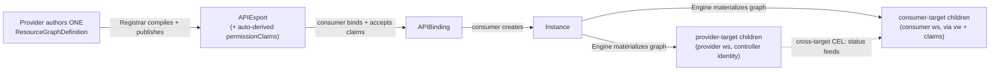

# krop-controller

**A kcp-native composition controller: one declarative blueprint → a bindable API → cross-workspace resource graphs. No Go controller per offering.**

`Status: alpha` · `License: Apache-2.0` · `Go 1.26` · `Runtime: kcp` · `Image: ghcr.io/opendefense/krop-controller`

krop-controller lets a provider author **one** declarative
`ResourceGraphDefinition` (RGD) blueprint. krop publishes it as a bindable kcp
**`APIExport`**, and for every consumer instance it materializes a graph of child
resources **split across the consumer and provider workspaces** — with CEL
dependencies allowed to cross between them. The provider writes **no Go controller
per offering**: the blueprint *is* the offering. krop reuses
[kro](https://github.com/kubernetes-sigs/kro)'s graph builder, CEL engine, and
client-free runtime as a **library**, and replaces kro's single-cluster machinery
with kcp-native publication, dual-target apply, and cross-workspace garbage
collection.

---

## How it works (at a glance)



A single provider process watches blueprints, publishes each as an `APIExport`,
and fans in **all** bound consumers behind one virtual-workspace manager per
blueprint. See [docs/architecture.md](docs/architecture.md) for the full picture,
workspace topology, and Mermaid flows.

---

## Quickstart

The fastest way to see krop work end-to-end, with **zero manual setup**:

```sh
make test-e2e
```

This spins up a kind cluster, installs cert-manager + kcp-operator, provisions a
real kcp (`RootShard` + `FrontProxy` + etcd), mints the controller's
workspace-scoped kubeconfig, deploys krop **via its own Helm chart as a pod**, then
runs the full provider→consumer flow (publish a blueprint, bind a consumer, create
an instance, watch children materialize across workspaces, GC) — 5/5 specs
including a negative least-privilege case. Set `E2E_SKIP_CLEANUP=1` to keep the
cluster and poke around.

For the real **hands-on** provider/consumer walkthrough (deploy the chart, mint
the identity, author a blueprint, bind, create an instance), follow
[docs/getting-started.md](docs/getting-started.md).

A **blueprint** is just a kro RGD served under krop's group, plus one routing
`target` per resource. Abbreviated (full example:
[`config/kcp/examples/blueprint-hosteddatabase.yaml`](config/kcp/examples/blueprint-hosteddatabase.yaml)):

```yaml
apiVersion: krop.opendefense.cloud/v1alpha1
kind: ResourceGraphDefinition
metadata:
  name: hosteddatabase
spec:
  schema:                                   # the generated instance API
    apiVersion: v1alpha1
    kind: HostedDatabase
    group: krop.opendefense.cloud
    spec:
      name: string
      engine: string | default="postgres"
    status:
      endpoint: ${connection.data.endpoint}
      vpcID: ${vpc.status.vpcID}
  resources:
    - id: vpc                                # CONSUMER-target read-only externalRef
      target: consumer
      externalRef:
        apiVersion: ec2.services.k8s.aws/v1alpha1
        kind: VPC
        metadata:
          name: ${schema.spec.name}-vpc
    - id: db                                 # HOST-target child (physical host cluster)
      target: host
      template:
        apiVersion: apps/v1
        kind: Deployment
        metadata:
          # prefix the child name with the consumer's kcp logical-cluster name
          # (globally unique + immutable) so two tenants never collide on the host.
          name: ${schema.metadata.annotations["krop.opendefense.cloud/consumer-cluster"]}-${schema.spec.name}
          namespace: databases
        spec:
          replicas: 1
          selector: { matchLabels: { app: ${schema.spec.name} } }
          template:
            metadata: { labels: { app: ${schema.spec.name} } }
            spec:
              containers:
                - name: db
                  image: ${schema.spec.engine}:16
                  env:
                    - name: VPC_ID
                      value: ${vpc.status.vpcID}   # consumer read → host write
    - id: connection                         # CONSUMER-target child (default)
      target: consumer
      template:
        apiVersion: v1
        kind: ConfigMap
        metadata:
          name: ${schema.spec.name}-connection
        data:
          endpoint: ${db.metadata.name}.databases.svc.cluster.local  # host → consumer CEL
          vpcID: ${vpc.status.vpcID}
```

New to blueprints? Start with
[docs/guides/writing-your-first-blueprint.md](docs/guides/writing-your-first-blueprint.md)
(a simpler single-child tutorial), then read the full
[authoring reference](docs/blueprints.md).

---

## Key features

- **Declarative blueprints.** Author one kro `ResourceGraphDefinition`; krop serves
  the generated instance kind. No per-offering Go controller.
- **Three-target materialization.** Each resource is routed by a single
  per-resource `target` field (default `consumer`): `consumer` children land in
  the tenant workspace (through the APIExport **virtual workspace** + the
  consumer's **accepted permissionClaims**); `provider` children land in the
  provider workspace (written with the controller's **own** kcp identity); `host`
  children land in the **physical host cluster** the controller runs in.
- **External references (read-only).** A resource can be an `externalRef` instead
  of a `template` — an existing object krop **reads but never creates or GCs**
  (single by `metadata.name`, or a collection by `metadata.selector`). Routed by
  `target` like any resource, its observed `status`/`data` funnels into other
  resources via `${id.status.x}` CEL — e.g. read a VPC in the consumer plane and
  feed `${vpc.status.vpcId}` into a VM written to the host cluster.
- **Cross-target CEL dependencies.** A consumer child can read a provider child's
  live `status.*` via `${...}` CEL; it **pends** until that status is set, then
  materializes.
- **Consumer workspace info in CEL.** The reconciler stamps the consumer's kcp
  logical-cluster name (globally unique + immutable) onto each instance as the
  `krop.opendefense.cloud/consumer-cluster` annotation, so a blueprint can derive
  **collision-free** host/provider child names by prefixing with
  `${schema.metadata.annotations["krop.opendefense.cloud/consumer-cluster"]}`.
- **Automatic APIExport publication.** The Registrar compiles each blueprint,
  mints an `APIResourceSchema`, **auto-derives** the `permissionClaims` from the
  consumer-target node GVRs, and upserts the `APIExport`.
- **Dynamic per-blueprint serving.** A Supervisor runs one multicluster manager
  per published APIExport, fanning in every bound consumer; it restarts on spec
  change and self-heals a crashed manager.
- **Cross-workspace GC + orphan sweep.** Finalizer-driven, label-based garbage
  collection across both workspaces, plus a liveness-record orphan sweep for the
  mid-life-unbind case owner references cannot cover.
- **Least-privilege by construction.** The chart renders **no** host-cluster
  ClusterRole/Role — only a ServiceAccount + Deployment. All authority lives in
  kcp RBAC + accepted claims.
- **HA & production-ready.** Leader election, Helm chart, health/metrics, and a
  full CI/CD pipeline.

---

## Documentation

| Doc | What it covers |
| --- | --- |
| [Getting Started](docs/getting-started.md) | The hands-on provider+consumer walkthrough: deploy, publish, bind, create an instance. |
| [Guides](docs/guides/) | Task-oriented how-tos (below). |
| — [Writing your first blueprint](docs/guides/writing-your-first-blueprint.md) | A from-scratch tutorial building a minimal single-child blueprint. |
| — [Cross-target dependencies](docs/guides/cross-target-dependencies.md) | The provider-status → consumer-child CEL recipe (pend-until-ready). |
| — [Deploying in production](docs/guides/deploying-in-production.md) | Identity, RBAC, `helm install` with HA + metrics. |
| — [Troubleshooting](docs/guides/troubleshooting.md) | Problem → cause → fix, with concrete `kubectl` checks. |
| [Blueprint authoring](docs/blueprints.md) | The RGD reference: schema, resources, CEL, target routing, claims, naming, pruning. |
| [Architecture](docs/architecture.md) | How krop is built and why; workspace topology, components, key flows, Mermaid diagrams. |
| [Decisions (ADRs)](docs/decisions/) | The 12 significant design decisions. |
| [Permissions](docs/permissions.md) | The least-privilege authorization model and checklist. |
| [Operations](docs/operations.md) | Production ops: flags, RBAC, observability, GC/sweep, upgrades, troubleshooting. |

---

## Install

```sh
helm install krop charts/krop-controller \
  --namespace krop-system --create-namespace \
  --set image.tag=<your-tag> \
  --set kcp.kubeconfigSecret.name=krop-kubeconfig
```

The chart does **not** template the kcp kubeconfig Secret — you provide it
out-of-band, and separately grant the controller's kcp identity least-privilege
RBAC. See [getting-started.md](docs/getting-started.md) and
[permissions.md](docs/permissions.md) for those prerequisites, and the
[production deploy guide](docs/guides/deploying-in-production.md) for a concise
recipe.

Image: `ghcr.io/opendefense/krop-controller`. Build artifacts locally:

```sh
make build          # build the controller binary
make docker-build   # build the container image
make helm-package   # package the Helm chart
```

---

## Development & testing

```sh
git clone https://github.com/opendefensecloud/krop-controller && cd krop-controller
make build          # build the binary
make test           # unit + envtest (downloads the pinned kcp test binary via the Makefile)
make test-e2e       # full stack: kind + kcp-operator + helm-deployed pod
make lint           # license headers, shellcheck, golangci-lint
```

- `make test` runs unit tests plus an **envtest** tier against a real in-process
  kcp (the Makefile downloads the pinned kcp test binary — `KCP_VERSION`, currently
  `0.30.0` — into `bin/`).
- `make test-e2e` requires Docker (kind) and takes several minutes.
- A **Nix flake devshell** provides the pinned toolchain (Go 1.26.4 via
  `dev-kit`): run `nix develop` (or use `direnv` with the checked-in `.envrc`).

Module: `go.opendefense.cloud/krop-controller` (Go 1.26).

---

## Contributing

- **Conventional commits** are enforced in CI (`feat`, `fix`, `docs`, `chore`,
  `refactor`, `test`, `ci`, `perf`, `revert`).
- Run `make lint` and `make test` before opening a PR.
- CI covers Go build/test/lint, Helm lint, conventional-commit checks, codegen
  drift, container build, and OSV vulnerability scanning.

## License

Apache-2.0.
