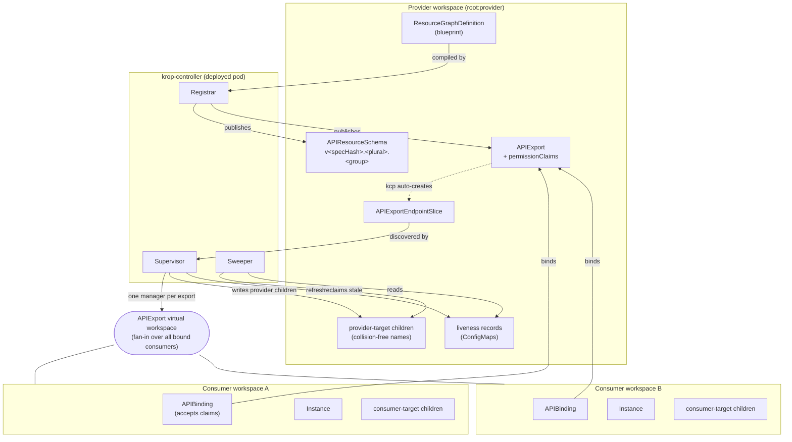
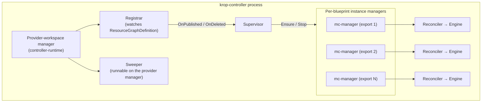

# krop-controller architecture

This document describes how krop-controller is built and why. It is written for
contributors and architects and is grounded in the code on `main`. For the
authorization model see [permissions.md](permissions.md); for the reasoning
behind individual design choices see the [decision records](decisions/).

## 1. Overview & motivation

krop is a **kcp-native composition controller**. A provider authors a single
declarative blueprint — a kro `ResourceGraphDefinition` (RGD) — in a provider
workspace. krop publishes that blueprint as a bindable kcp **APIExport**.
Consumers bind the export and create **instances** of the generated API kind. For
every instance, krop materializes a graph of child resources whose nodes are
**split across two workspaces** — the consumer's own workspace and the provider's
workspace — with CEL dependencies allowed to cross between them. The provider
writes **no Go controller per offering**: the RGD *is* the offering.

krop reuses [kro](https://github.com/kubernetes-sigs/kro) (v0.9.2) as a
**library**, not as a controller. It imports kro's graph builder, CEL engine, and
client-free runtime (`FromGraph` → per-node `GetDesired`/`SetObserved`/
`CheckReadiness`), and it **replaces** kro's single-cluster machinery (the local
CRD + per-RGD micro-controller, the ApplySet applier, the dynamic-informer watch
coordinator) with kcp-native machinery.

Contrast with vanilla kro:

| Concern | Vanilla kro | krop |
| --- | --- | --- |
| API surface | Creates a local CRD + a per-RGD micro-controller | Publishes an **APIExport**; consumers get the type by **APIBinding** |
| Tenancy | One manager binds one cluster/endpoint → one deployment per workspace | One manager per APIExport **virtual workspace** fans in *all* bound consumers |
| Child placement | Applies every child into the single cluster it runs against | Routes each resource to the **consumer** / **provider** workspace or the **host** cluster by a per-resource `target` field |
| Inputs | Reads only what it creates | Also **reads** existing objects on any plane via `externalRef` (read-only, never created/GC'd) |
| Apply / GC | ApplySet + dynamic client (single-cluster) | Server-side apply per target + label/finalizer/ownerRef GC + orphan sweep |

What krop keeps from kro: the RGD authoring surface (`spec.schema` SimpleSchema
shorthand, `spec.resources[]` with `readyWhen`/`includeWhen`/`forEach`/`${...}`
CEL), the DAG builder and cycle check, the CEL type-checker and evaluator, and the
client-free runtime that resolves desired objects and checks readiness. krop's
blueprint spec is a **thin wrapper** over kro's `ResourceGraphDefinitionSpec`: it
inlines kro's resource verbatim and adds exactly one krop-owned, enum-validated
field per resource — `target` (`consumer` | `provider` | `host`). A build-time
`ToKro()` conversion strips `target` into a routing map and hands the graph builder
pristine kro types, so kro's builder/runtime never see the krop field. Resources
may also be `externalRef` reads (kro-native) instead of `template` writes; krop
reads those but never creates or GCs them.

## 2. Workspace topology

krop spans three roles of kcp workspace (plus, for the `host` target, a physical
non-kcp cluster — see [three-plane composition](#three-plane-composition-target--externalref)):

- **Provider workspace** — where the blueprint (`ResourceGraphDefinition`) is
  authored, where the `APIExport` + `APIResourceSchema` are published, where the
  controller's own identity has RBAC, and where **provider-target children** land.
  The controller connects here with a workspace-scoped kubeconfig.
- **Consumer workspaces** — each binds the blueprint's APIExport (accepting its
  permission claims), creates **instances** of the generated kind, and receives
  the **consumer-target children**. The controller holds *no* standing RBAC here.
- **APIExport virtual workspace** — a single kcp endpoint (named by an
  `APIExportEndpointSlice`) that **fans in** every bound consumer behind one URL,
  each object tagged by its logical-cluster name. This is what removes kro's
  "one deployment per workspace" limit: one manager serves all consumers of a
  blueprint.



### Three-plane composition (`target` + `externalRef`)

Beyond the two kcp write planes, a resource can route to a third — the physical
**host** cluster the controller pod runs in (`target: host`) — and can be a
**read-only `externalRef`** on any plane instead of a written `template`. Two
orthogonal axes describe every resource:

- **write planes** (`template` + `target`): `consumer` (tenant ws, via the vw +
  accepted claim), `provider` (provider ws, controller identity), `host` (physical
  cluster, in-cluster / `--host-kubeconfig` client).
- **read plane** (`externalRef` + `target`): an existing object krop Gets/Lists but
  never writes, on any of the three planes. Its observed status funnels into other
  resources via `${id.status.x}` CEL.

This is what turns krop into an api-syncagent-style bridge: pull an input from one
plane and funnel it into a child on another. The canonical flow — read a **VPC**
(consumer, read-only) and provision a **VM** into the **host** cluster wired to
`${vpc.status.vpcId}`:

```mermaid
flowchart LR
  subgraph consumer["Consumer workspace (READ plane)"]
    VPC["VPC (externalRef)<br/>read-only claim: get/list/watch<br/>never created / GC'd"]
  end
  subgraph provider["Provider workspace (WRITE plane)"]
    LR2["liveness record<br/>tracks provider + host child GVKs"]
  end
  subgraph host["Physical host cluster (WRITE plane)"]
    VM["VM (template, target: host)<br/>collision-free name + GC labels"]
  end

  ENG(["Engine (client-free runtime)"])

  VPC -->|Get → SetObserved| ENG
  ENG -->|CEL: ${vpc.status.vpcId}| ENG
  ENG -->|SSA via host client| VM
  ENG -->|refresh| LR2
  LR2 -.->|Sweeper reclaims host + provider children on mid-life unbind| VM
```

Routing is uniform: the same `target` field selects the plane for both `template`
writes and `externalRef` reads. External nodes are never applied, labeled, owned,
renamed, or recorded — so GC/prune/sweep skip them. Host children reuse the entire
provider-target machinery (collision-free naming, GC labels, prune, orphan sweep)
over a separate host client, so they are reclaimed the same way provider children
are. See [decisions/0011-external-refs-and-host-target.md](decisions/0011-external-refs-and-host-target.md).

## 3. Components

| Component | Package / key files | Responsibility |
| --- | --- | --- |
| **Blueprint CRD** | `api/v1alpha1/` | Cluster-scoped `ResourceGraphDefinition` (shortName `rgd`) whose spec is kro's RGD spec verbatim plus a krop-owned `Status` (`ExportedAPI`, `IdentityHash`, `ObservedSpecHash`, conditions). |
| **Registrar** | `internal/registrar/` | Watches blueprints; compiles each into a kro graph, mints the APIResourceSchema, derives permissionClaims, upserts the APIExport, writes status, and drives cascade-unpublish on delete. Owns the compiled-graph cache. |
| **Supervisor** | `internal/supervisor/` | Owns one instance-serving multicluster manager per published APIExport: start in a goroutine with a cancellable context, restart on spec change, self-heal a crashed manager. |
| **Engine** | `internal/engine/` | The client-free reconcile core: drives kro's runtime node-by-node, routes each resource by its `target` (via the build-time routing map), reads `externalRef` nodes through a `Reader`, and owns all apply/observe I/O through the `Applier` / `Reader` chains. |
| **Reconciler** | `internal/controller/reconciler.go` | The dual-target instance reconcile: finalizer, engine drive, status projection + conditions, prune, and the liveness heartbeat. Shared by the deployed controller and the envtest suite. |
| **Sweeper** | `internal/controller/sweeper.go` | Orphan GC: reclaims provider-target children of instances that unbound the APIExport mid-life, keyed off stale liveness records, with a startup grace period. |
| **kcp helpers** | `internal/kcp/` | Workspace-scoped kubeconfig validation and `APIExportEndpointSlice` discovery. |

The control plane runs as **one process** (`cmd/controller/main.go`) against a
single provider-workspace kubeconfig:



Only the provider manager serves metrics and health probes; the per-blueprint
instance managers disable their metrics server to avoid a port collision (there is
one per published blueprint).

### The applier decorator chain

The engine never talks to a cluster directly. Each child is applied through an
`Applier` (`internal/engine/apply.go`), and the Reconciler composes a
**different decorator chain per target**
(`internal/controller/reconciler.go`):

- **Consumer children:** `LabelingApplier( OwnerRefApplier( RecordingApplier( SSAApplier ) ) )`
- **Provider children:** `LabelingApplier( QualifyingApplier( RecordingApplier( SSAApplier ) ) )`
- **Host children:** `LabelingApplier( QualifyingApplier( RecordingApplier( SSAApplier ) ) )` over the **host client** (same chain as provider — collision-free names + GC labels — but targeting the physical host cluster; registered only when a host client is configured).

`externalRef` nodes take **no** applier chain at all: they are read through a
`Reader` (`ClientReader` per target — consumer via the vw, provider via the
provider client, host via the host client), `SetObserved`, and readiness-checked,
but never applied, labeled, owned, renamed, or recorded.

| Decorator | Role |
| --- | --- |
| `LabelingApplier` | Stamps the GC-tracking labels (`instance-uid`, `consumer-cluster`, `blueprint`) so children are enumerable by label across workspaces. |
| `OwnerRefApplier` | *Consumer only.* Sets an ownerReference to the instance — a GC backstop for kcp's per-workspace collector if the finalizer path is ever bypassed. Owner refs are workspace-local, so provider and host children cannot use it (they rely on labels + liveness sweep instead). |
| `QualifyingApplier` | *Provider + host.* Renames the child to a collision-free name (`ProviderChildName`) because many consumers' provider/host children share the one provider workspace / host cluster. |
| `RecordingApplier` | Innermost decorator: records each applied child's final identity (GVK/namespace/name, *after* rename + labels) into a per-target sink used for prune bookkeeping. |
| `SSAApplier` | Server-side apply (field manager `krop-controller`, force ownership) **then a read-back Get**. The read-back is load-bearing: cross-target CEL observes a provider child's *status* to feed a downstream consumer child, and the apply result alone does not reflect status-subresource fields set by other controllers. |

`RecordingApplier` must sit innermost so it observes the final name and merged
labels; `OwnerRefApplier`/`QualifyingApplier` are mutually exclusive by target.

## 4. Key flows

### 4.1 Publish flow

When a blueprint is created or edited, the Registrar compiles it and publishes the
API, then the Supervisor starts serving instances.

```mermaid
sequenceDiagram
  participant Provider
  participant Registrar
  participant kcp as kcp (provider ws)
  participant Supervisor
  participant IM as Instance manager

  Provider->>kcp: create ResourceGraphDefinition
  Registrar->>Registrar: add teardown finalizer
  Registrar->>Registrar: SpecHash(spec); cache lookup
  alt not cached
    Registrar->>kcp: build kro graph (discovery/OpenAPI for child GVKs)
  end
  Registrar->>kcp: create APIResourceSchema (v<specHash>.<plural>.<group>)
  Registrar->>kcp: list APIBindings → identityHash per GroupResource
  Registrar->>Registrar: DeriveClaims from consumer-target foreign GVRs
  Registrar->>kcp: SSA APIExport (schema ref + permissionClaims)
  Registrar->>Supervisor: OnPublished(export, gvk, graph, changed)
  Supervisor->>IM: Ensure (start manager if not running)
  Registrar->>kcp: re-Get APIExport → status.identityHash
  Registrar->>kcp: write blueprint status (Ready=True)
  IM->>kcp: poll for APIExportEndpointSlice
  IM->>kcp: build apiexport provider + start reconciling
```

Notes:
- The ARS name is `v<specHash>.<plural>.<group>` (`CRDToAPIResourceSchema` prefixes
  `crd.Name` with `"v"+specHash`). ARS objects are immutable once served, so the
  Registrar creates-if-absent and never patches an existing schema.
- `changed` is `true` for a new blueprint (empty `ObservedSpecHash`) or a spec
  edit (new hash), `false` for the 5-minute unchanged resync. The wiring restarts
  the instance manager only when `changed` is true.
- If a foreign (non-core) claim's identityHash can't be resolved (the owning
  APIExport isn't bound in the provider workspace yet), the publish fails
  `Ready=False` rather than emit a silently-broken claim; the resync retries.

### 4.2 Instance reconcile (dual-target + cross-target CEL)

```mermaid
sequenceDiagram
  participant Consumer
  participant VW as Virtual workspace
  participant Rec as Reconciler
  participant Eng as Engine
  participant CC as Consumer client (vw + claims)
  participant PC as Provider client (direct)

  Consumer->>VW: create Instance
  VW->>Rec: reconcile(cluster, name)
  Rec->>CC: Get instance
  Rec->>CC: add finalizer (before any apply) → requeue
  Rec->>Eng: FromGraph(graph, instance); Reconcile(appliers)
  loop nodes in topological order
    Eng->>Eng: IsIgnored? (includeWhen)
    Eng->>Eng: GetDesired (resolve CEL vs observed)
    alt dependency pending (ErrDataPending)
      Eng-->>Rec: Ready=false, Requeue, Complete=false
    else resolved
      Eng->>Eng: route by node's target (routing map)
      alt externalRef node
        Eng->>Eng: Reader.Get/List (never apply); NotFound ⇒ pend
      else target = provider / host
        Eng->>PC: SSA (collision-free name) + read back status
      else target = consumer
        Eng->>CC: SSA (labels + ownerRef) + read back
      end
      Eng->>Eng: SetObserved → downstream CEL resolves
      Eng->>Eng: CheckReadiness
    end
  end
  Rec->>PC: upsert liveness record (every apply pass)
  alt complete pass
    Rec->>CC: prune labeled children not in applied set
    Rec->>PC: prune labeled children not in applied set
  end
  Rec->>CC: project status.* (CEL) + set Ready/Progressing conditions
  Rec-->>VW: requeue (~30s heartbeat)
```

The **cross-target** case: a consumer-target child that references
`${providerNode.status.x}` cannot resolve until the provider child exists and its
controller has populated that status field. The engine applies the provider child
first (topological order), reads its status back, and feeds it via `SetObserved`.
Until the field is set, `GetDesired` on the consumer child returns
`ErrDataPending`; the engine reports `Ready=false, Requeue, Complete=false` and
converges on a later pass. `Complete=false` deliberately suppresses prune so the
prefix that *was* applied is not mistaken for the full desired set.

The **liveness record** is refreshed on *every* apply pass — including an
incomplete (pending-dependency) pass — because the provider child is created
before the consumer child's dependency resolves, and that provider child needs a
liveness record immediately in case the consumer unbinds during the pending
window. Only prune is gated on `Complete`.

Before building the kro runtime, the reconciler also **stamps the consumer's kcp
logical-cluster name** (globally unique + immutable) onto a runtime-only copy of the
instance as the `krop.opendefense.cloud/consumer-cluster` annotation
(`internal/engine/workspace.go`), so blueprint CEL can reference it via
`${schema.metadata.annotations["krop.opendefense.cloud/consumer-cluster"]}` to derive
collision-free host/provider child names. The stamp is never persisted — only the
pristine instance is status-updated. See
[decisions/0012-consumer-workspace-info-in-cel.md](decisions/0012-consumer-workspace-info-in-cel.md).

### 4.3 Garbage collection

Two paths. The normal path is the instance finalizer; the safety net is the
orphan sweep for a mid-life unbind (where the finalizer can never fire because the
reconciler stops seeing the instance).

```mermaid
flowchart TB
  subgraph normal["Normal delete (finalizer)"]
    D1["Instance deleted<br/>(DeletionTimestamp set)"]
    D2["Reconciler: list children by instance-uid label<br/>in BOTH workspaces"]
    D3["Delete consumer children (vw)<br/>+ ownerRef backstop"]
    D4["Delete provider children (direct)"]
    D5["Delete liveness record"]
    D6["Remove finalizer → object GC'd"]
    D1 --> D2 --> D3 --> D4 --> D5 --> D6
  end

  subgraph orphan["Mid-life unbind (Sweeper)"]
    O1["Consumer deletes APIBinding"]
    O2["Virtual workspace disengages that cluster<br/>→ reconciler stops running for it<br/>→ finalizer NEVER fires"]
    O3["Liveness record stops being refreshed<br/>→ goes stale (> StaleAfter)"]
    O4["Sweeper (after startup grace):<br/>delete recorded provider child GVKs<br/>by instance-uid label"]
    O5["Delete the stale liveness record"]
    O1 --> O2 --> O3 --> O4 --> O5
  end
```



Why two mechanisms are needed: Kubernetes owner references are
workspace-local, so a consumer-workspace instance cannot own provider-workspace
children. Provider children are therefore tracked by a **label set**
(`instance-uid`, `consumer-cluster`, `blueprint`) and deleted by label on the
finalizer path. The orphan sweep exists because an unbind removes the reconciler's
visibility of the instance entirely: the provider-side **liveness record** (a
labeled ConfigMap carrying `lastReconciled` and the provider-child GVKs) is the
only provider-side handle left, and the Sweeper reclaims children whose record has
gone stale. The Sweeper defers its first pass by a full `StaleAfter` window
(startup grace) so a fleet-wide catch-up after a controller restart cannot wrongly
sweep still-live instances whose records simply have not been refreshed yet.

## 5. Permission model

krop is least-privilege by construction: the deployed pod holds **no
hosting-cluster ClusterRole/Role** (the chart renders only a ServiceAccount +
Deployment). All real work happens in kcp, authorized through a mounted,
workspace-scoped kubeconfig:

- **Root workspace:** read-only (enter child workspaces, resolve path → cluster).
- **Provider workspace:** own the blueprints + scoped `apis.kcp.io` +
  deployment-specific provider-target child GVKs + liveness ConfigMaps.
- **Consumer workspaces:** *zero* standing RBAC. Consumer-target writes flow
  through the APIExport **virtual-workspace identity**, authorized only by the
  consumer's **accepted `permissionClaims`** — the claims the Registrar
  auto-derives from the blueprint's consumer-target node GVRs (full CRUD for
  writable children, **read-only** `get,list,watch` for consumer `externalRef`
  reads). Revoking = deleting the binding.
- **Host cluster:** the `target: host` plane is **provider-managed** and outside
  krop's least-privilege model — the chart ships no host ClusterRole; the host
  client (in-cluster or `--host-kubeconfig`) uses whatever RBAC the provider grants
  out-of-band. Nil host config ⇒ host target disabled (fail-closed).

Provider- and host-target children are written with the controller's own /
the host client (same ownership domain, no claim needed).

Full detail — identity minting, RBAC fixtures, and the claim/acceptance handshake
— is in [permissions.md](permissions.md).

## 6. Testing tiers

| Tier | Command | What it covers |
| --- | --- | --- |
| **Unit** | `go test` (part of `make test`) | The engine loop, routing, applier decorators, naming, claims derivation, hashing, supervisor lifecycle — with fakes/in-memory graphs, no cluster. |
| **envtest** | `make test` | Registrar + Reconciler + Sweeper against a **real in-process kcp** (binary v0.30.0, matching multicluster-provider v0.8.0's tested version). Publishes an APIExport, binds a consumer, drives an in-process multicluster manager against the virtual workspace, and asserts dual-target apply / prune / spec-change restart / orphan sweep. |
| **Full-stack e2e** | `make test-e2e` | The controller **as a deployed pod** in a kind cluster, against real kcp provisioned by kcp-operator, installed via krop's own Helm chart. Includes a **negative least-privilege** spec (a consumer that does not accept a claim → the consumer-target write is rejected). |

The envtest tier drives the same `Reconciler` the deployed controller uses. Its
harness observes the **bind-first ordering rule**: an `APIExportEndpointSlice`'s
virtual-workspace URL is empty until at least one consumer `APIBinding` consumes
it, so a consumer must bind before the instance manager can engage.

## 7. Known limitations & future work

- **Single-version APIExport serving.** A blueprint spec edit is handled by
  restarting the per-export instance manager to serve the *new* compiled graph
  (change-detected `Stop`+`Ensure`). This is not multi-version serving: an
  incompatible schema change across an in-place version is not served alongside
  the old one. Proper multi-version serving (existing instances stay on their
  bound version while new instances use the new one) is a documented future
  enhancement.
- **Timing-based orphan sweep.** The mid-life-unbind reclaim is driven by a
  staleness threshold (`StaleAfter`) plus a startup grace period, not by an event.
  It is intentionally conservative (a large margin over the ~30s heartbeat) to
  avoid ever sweeping a live instance; the cost is a bounded delay before an
  orphaned provider child is reclaimed.
- **Deployment-specific provider-child RBAC.** The GVKs a blueprint writes into
  the provider workspace are known only to the operator, so the provider-workspace
  RBAC fixture ships an *example* rule that operators must replace with their exact
  provider-target GVKs (never a `*`/`*` wildcard). See
  [permissions.md](permissions.md).
- **No cross-workspace transaction.** A provider-target apply can succeed while a
  consumer-target apply is rejected (e.g. an unaccepted claim). krop reports both
  and converges on requeue; it never rolls back. Every apply is idempotent (SSA).
</content>
</invoke>
